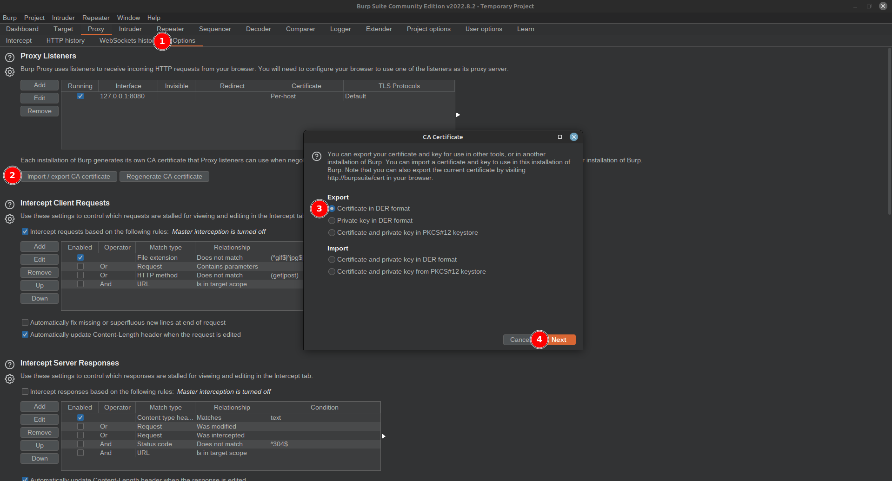
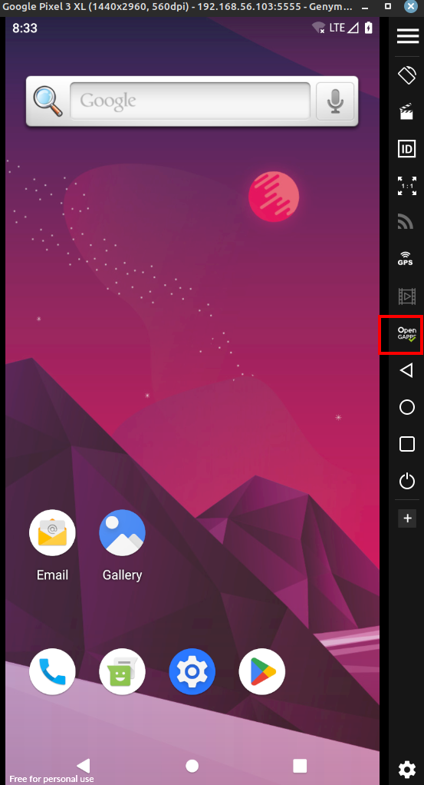
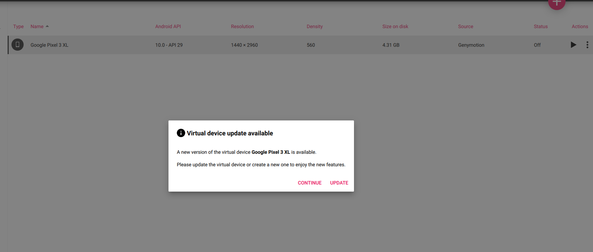
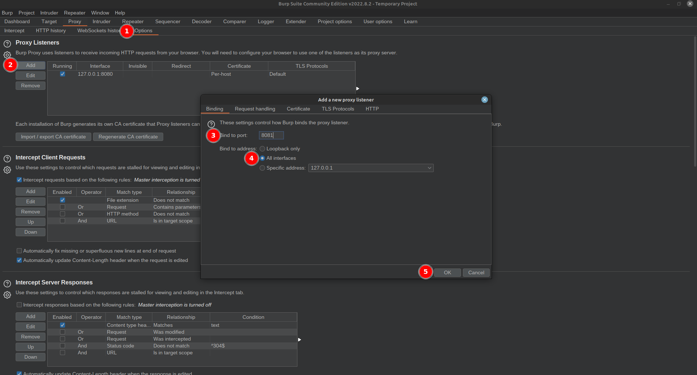
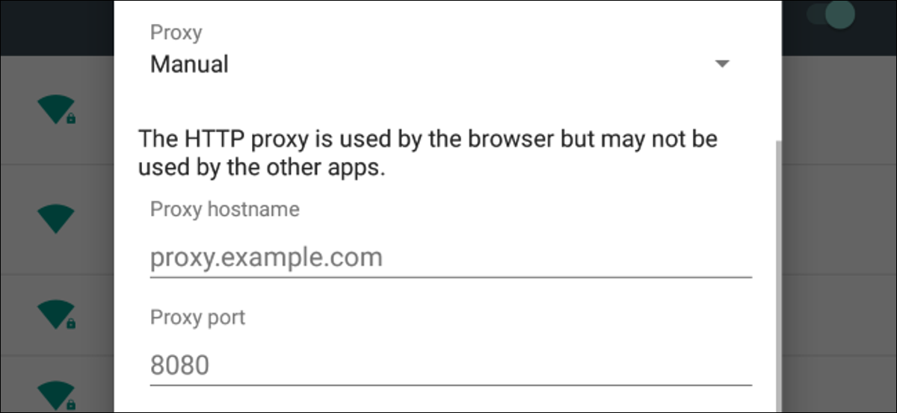

# Pentest Mobile
Um pequeno setup para pentest em aplicações mobile.

### Requerimentos
- [Genymotion](https://www.genymotion.com/download/) - Instale e configure um device no Genymotion. Recomendo o Google Pixel 3 XL com Android 10.
- [Burp suite](https://portswigger.net/burp/communitydownload) - Tenha o Burp Suite instalado.

Obs: Crie uma conta gratuita no Genymotion [aqui](https://www-v1.genymotion.com/account/create/). 

Referências:
- [blog.ropnop.com - Artigo](https://blog.ropnop.com/configuring-burp-suite-with-android-nougat/)
- [k3nziy - Youtube video](https://www.youtube.com/watch?v=JTZ81f2qivQ)  

#
## Exportar Certificado do Burp Suite

*A partir do Nougat, o Android mudou o comportamento padrão de confiar nos certificados instalados pelo usuário. Por este motivo não conseguimos mais importar o certificado pelo arquivo diretamente pelo dispositivo.*

1 - Export Burp certificate to .DER e.g cacert.der
  
2 - Rode o comando abaixo para converter o certificado. 
```
openssl x509 -inform DER -in cacert.der -out cacert.pem  
```

3 - Capturar hash do certificado, a saida deve ser um hash a ser substituido nos próximos comandos.
```
openssl x509 -inform PEM -subject_hash_old -in cacert.pem |head -1
```  

4 - Substitua a hash abaixo `9a5ba575` pela sua hash obtida no comando anterior.
```
mv cacert.pem 9a5ba575.0  
```

## Configuração do certificado no dispositivo mobile
OBS: use o adb do genymotion disponivel na pasta `genymotion/tools/` (local onde seu genymotion foi instalado)  

```
./genymotion/tools/adb devices
./genymotion/tools/adb connect <android-ip>:5555     
./genymotion/tools/adb root  
./genymotion/tools/adb remount  
./genymotion/tools/adb push 9a5ba575.0 /sdcard/  
./genymotion/tools/adb shell  
mv /sdcard/9a5ba575.0 /system/etc/security/cacerts/  
chmod 644 /system/etc/security/cacerts/9a5ba575.0  
reboot
```  
### Considerações sobre o Genymotion
- Após virtualizar um device, clique em GAPS na barra lateral para instalar a loja Play Store do Google.  

  

- Se ao inicializar o device solicitar uma atualização, clique em **Continue**. Se seguir com a atualização (update) o certificado pode deixar de funcionar e o processo acima terá que ser refeito.   

  

## Configurando o Burp Suite para interceptar as requisições do dispositivo Android.


- Observação:  **Sempre que fechar o Burp Suite, ao iniciar um novo teste a configuração acima deve ser refeita. O Burp não salva essas configurações.**  
- Faça a configuração do proxy antes de iniciar o Genymotion.  

## Configurando o proxy - Rede 2.4gz
Configuração no dispositivo Android para conversar com o Burp Suite.

- Acesse as configurações do Android em "Wi-Fi". 
- Toque sobre a rede que você está conectado.
- Clique em editar (icone de lápis)
- opções avançadas >> proxy >> manual
- Preencha o host e a porta (8081) com os dados da máquina onde o burp suite estiver sendo executado e salve.

  

Agora você pode interceptar todas as solicitações e respostas do aplicativo usando seu conjunto de burp.  


# Engenharia reversa de APK e análise estática de aplicativos
Vamos utilizar o aplicativo [Mobile Security Framework (MobSF)](https://github.com/MobSF/Mobile-Security-Framework-MobSF)
 para análise estatica de código.
   

- Veja a [documentação oficial](https://mobsf.github.io/docs/#/).
- Veja os [requisitos](https://mobsf.github.io/docs/#/requirements) antes de instalar.
- Passo a passo da [instalação](https://mobsf.github.io/docs/#/installation).
- Github oficial [aqui](https://github.com/MobSF/Mobile-Security-Framework-MobSF).
- Divirta-se!
